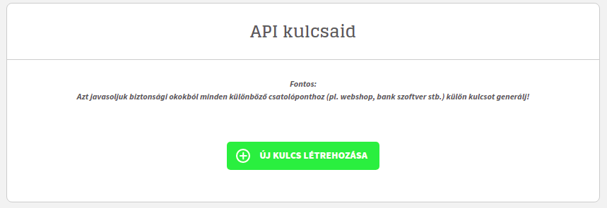
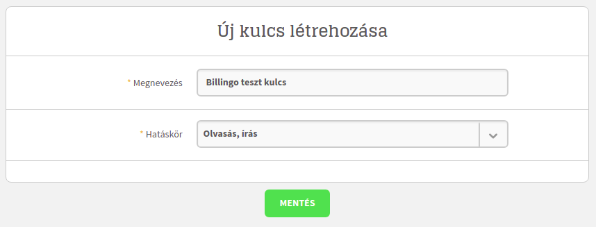

# Laravel Billingo

<p align="center">
<a href="https://packagist.org/packages/otisz/laravel-billingo"></a>
<a href="https://github.com/Otisz/Laravel-Billingo/actions"></a>
<a href="https://packagist.org/packages/otisz/laravel-billingo/stats"></a>
<a href="https://packagist.org/packages/otisz/laravel-billingo"></a>
</p>

[Billingo](https://www.billingo.hu) API V3 integration for Laravel.

## 🔧 Installation

You can install the package via [Composer](https://getcomposer.org/)

```bash
$ composer require otisz/laravel-billingo
```

You can publish the config file with:

```bash
$ php artisan vendor:publish --tag=billingo
```

When published, [the `config/billingo.php` config](config/billingo.php) file contains:

```php
<?php

return [
    /*
     * Billing API V3 Key
     *
     * @see https://app.billingo.hu/api-key
     */
    'api_key' => env('BILLINGO_API_KEY'),
];

```

## 🚀 Setup

Before you can use the Billingo service provider you have configure it with your API key.
You can access your API keys here: [https://app.billingo.hu/api-key](https://app.billingo.hu/api-key).

### Step 1

Click on GENERATE NEW KEY (ÚJ KULCS LÉTREHOZÁSA).

<div align="center"></div>

### Step 2

- Title (Megnevezés): Unique identifier for your token. This title will appear in the document list.
- Select "Read, write" ("Olvalsás, írás") option so that you can use the package without any problems.

<div align="center"></div>

### Step 3

Put your API key into your `.env` or `billingo.php` config file.

## Contributing

Thank you for considering contributing to Laravel Billingo! You can read the contribution guide [here](.github/CONTRIBUTING.md).

## Security Vulnerabilities

Please review [our security policy](https://github.com/Otisz/Laravel-Billingo/security/policy) on how to report security vulnerabilities.

## Licence

The Laravel Billingo package is open-source software licensed under the [MIT license](LICENSE.md).
